# jigsaw-static-analysis-lab
Static analysis of Jigsaw ransomware using PEStudio and VirusTotal. MITRE ATT&CK mapped.

# Jigsaw Ransomware Static Analysis Lab

**Sample:** JigsawRansomware.exe  
**SHA256:** F32A14E2A7A2510862C04FDC2E9AE97BB4F444D33DC5394360AD3402548BF687  
**Source:** MalwareBazaar (bazaar.abuse.ch)  
**Date:** June 14, 2026  
**Environment:** Swordfish II — Windows 11 VM, isolated, Defender disabled  
**Tools:** PEStudio 9.61, VirusTotal

---

## Overview

Jigsaw is a .NET ransomware strain first observed in 2016, built on the HiddenTear open-source framework. It encrypts files, appends a `.locked` extension, and deletes files on an hourly countdown until the victim pays. This lab covers static analysis only — no detonation.

---

## Sample Metadata

| Field | Value |
|---|---|
| Original filename | JigsawRansomware.exe |
| File type | Executable, 32-bit, GUI |
| Size | 335 KB (343,044 bytes) |
| Entropy | 7.356 |
| Compiler | Microsoft Linker 48.0 / .NET |
| Compile timestamp | Sun Feb 10 07:39:52 2019 (UTC) |
| VirusTotal score | 56/72 |
| Family labels | jigsaw, msil, hiddentear |

Sample sourced from MalwareBazaar using the `Jigsaw` tag filter:

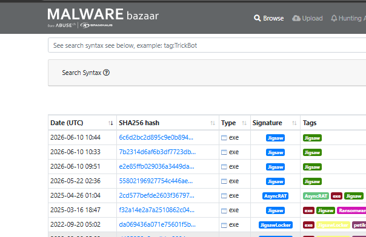

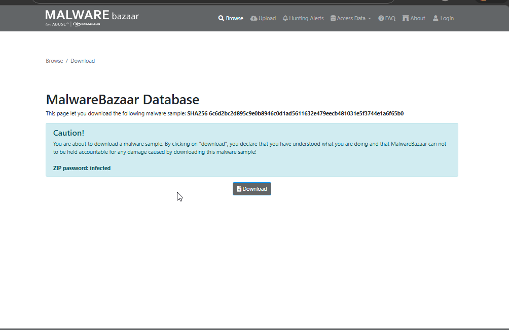

PEStudio file overview confirming metadata:

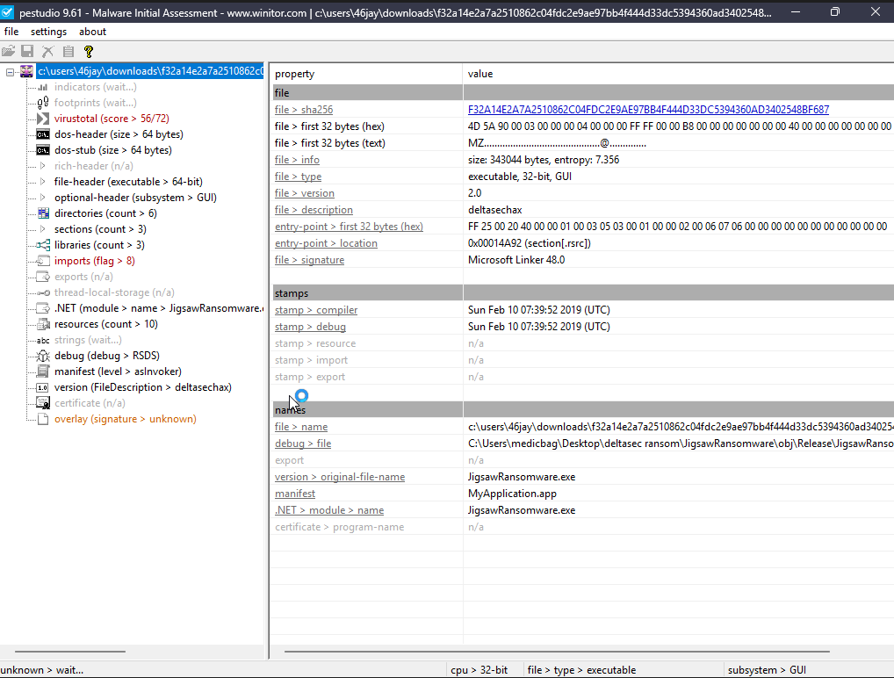

---

## Static Analysis Findings

### File Header

PEStudio confirmed a valid MZ/PE header. The file is a 32-bit .NET executable compiled with Microsoft Linker 48.0. The .NET module name is `JigsawRansomware.exe`, and the debug path leaked the developer's machine: `C:\Users\medicbag\Desktop\deltasec ransom\JigsawRansomware`. The threat actor used the alias DeltaSEC Corp.

### Entropy

Entropy of 7.356 indicates partial obfuscation. Combined with the `obfuscated` behavior tag on VirusTotal and `detect-debug-environment` flagging, the binary uses anti-analysis techniques — consistent with the sample terminating when opened inside a VM analysis environment.

PEStudio indicators tab flagging suspicious characteristics:

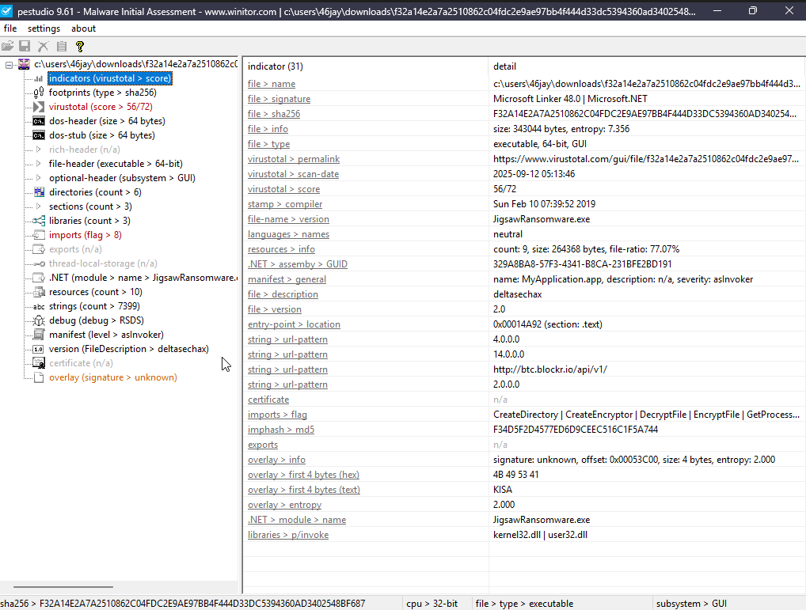

### Imports

PEStudio flagged 8+ suspicious imports:

- `CreateEncryptor` / `DecryptFile` / `EncryptFile` — file encryption
- `CreateDirectory` — directory traversal
- `SetStartupRegistry` / `RemoveStartupRegistry` — persistence and cleanup
- `GetProcess` — process enumeration

### Strings Analysis

7,399 strings extracted. Key findings:

**Ransom note text (hardcoded):**
- "Your personal files are being deleted and encrypted by DeltaSEC"
- "Every hour we select some of them to delete permanently"
- "If you turn off your computer or try to close our software, all your files will be encrypted and you will never access them"
- "DON'T TRY THAT ASSHOLE... WE KNOW EVERYTHING"
- "Thanks from your friends at DeltaSEC Corp. #2019"
- "Please, send at least $... worth of Bitcoin here"

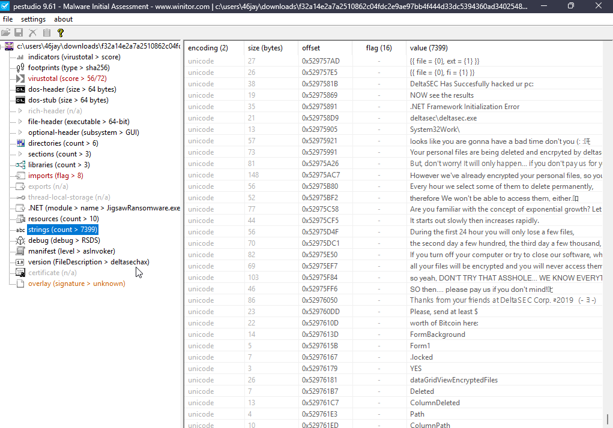

**Payment infrastructure:**
- Bitcoin address: `12Xspzstah37626slkwKhsKSH`
- Bitcoin API: `http://btc.blockr.io/api/v1/`
- Functions: `vanityAddresses`, `coin/info/`, `address/balance/`, `buttonCheckPayment`

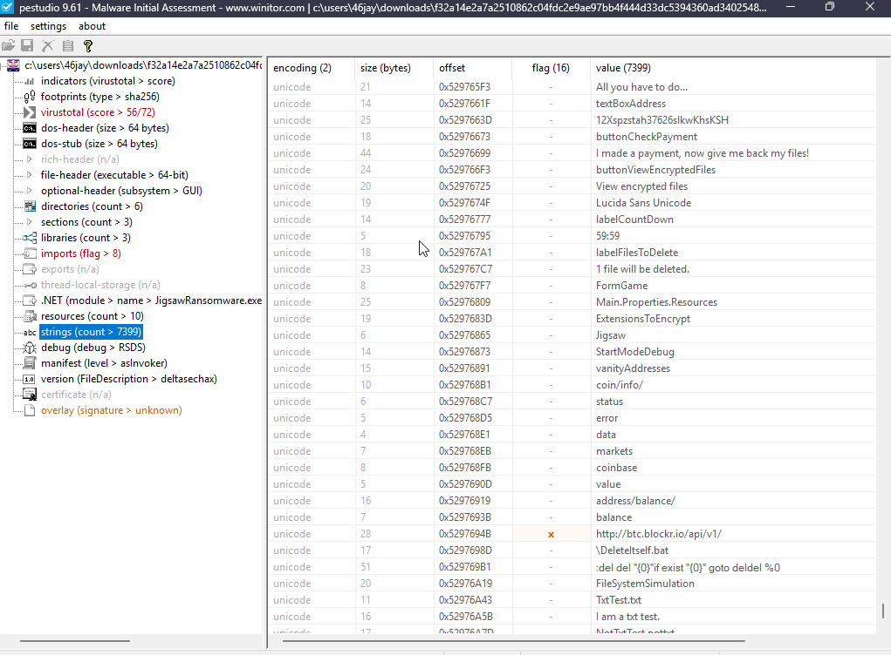

**Target file extensions:**
`.jpg .jpeg .raw .tif .gif .png .bmp .3dm .max .accdb .db` (partial list)

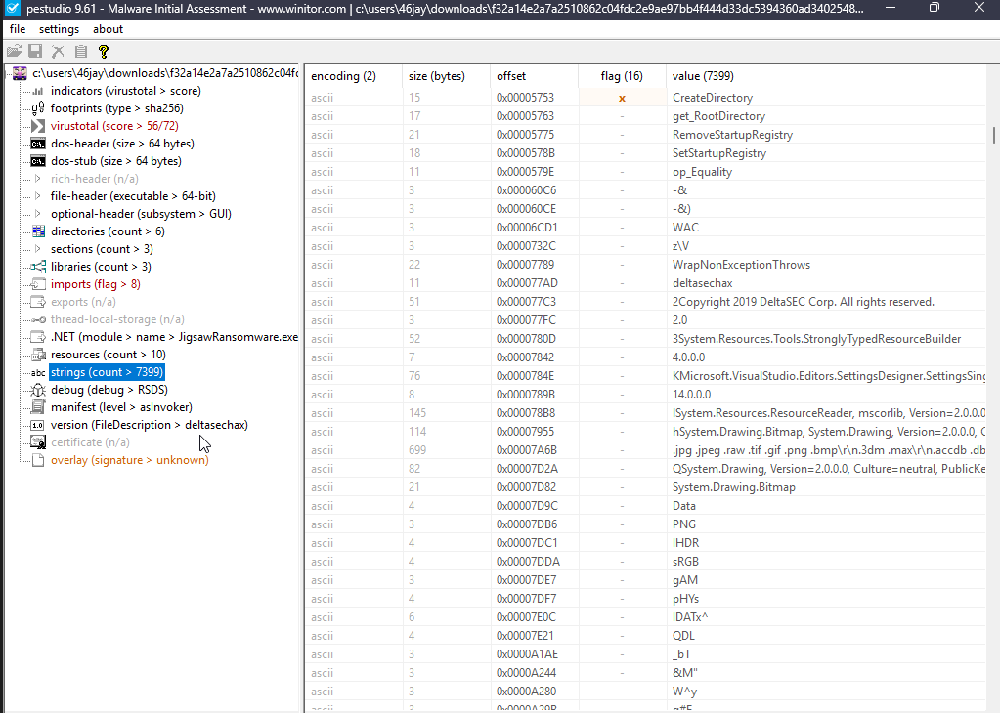

**Ransomware mechanics:**
- `ExtensionsToEncrypt` — file targeting list
- `RansomUsd` — dollar amount variable
- `labelFilesToDelete` / `labelCountDown` — deletion countdown UI
- `59:59` — countdown timer start value
- `.locked` — extension appended to encrypted files
- `\DeleteItself.bat` — self-deletion script post-payment

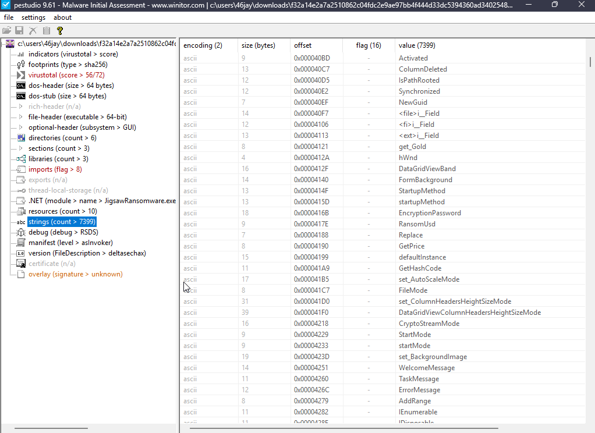

### VirusTotal

56 of 72 engines flagged this sample as malicious. Selected detections:

| Vendor | Detection |
|---|---|
| CrowdStrike | Win/malicious_confidence_100% |
| ESET-NOD32 | A Variant Of MSIL/Filecoder.Jigsaw.B |
| Emsisoft | Trojan-Ransom.Jigsaw (A) |
| Avira | TR/Jigsaw.xxwro |
| AliCloud | Ransomware:Win/Jigsaw.AZ |

Behavior tags: `detect-debug-environment`, `long-sleeps`, `obfuscated`, `persistence`

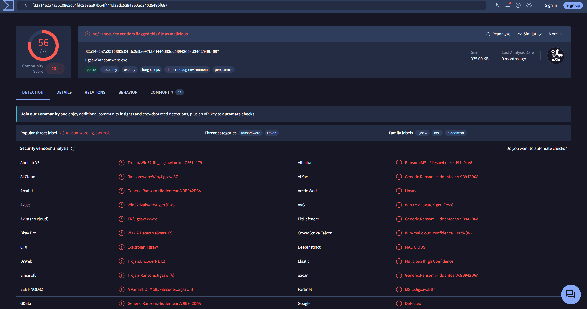

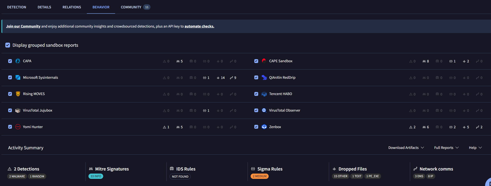

---

## MITRE ATT&CK Mapping

| Tactic | Technique | ID |
|---|---|---|
| Execution | Native API | T1106 |
| Execution | Shared Modules | T1129 |
| Persistence | Registry Run Keys / Startup Folder | T1060 |
| Persistence | Boot or Logon Autostart Execution | T1547 |
| Privilege Escalation | Process Injection | T1055 |
| Defense Evasion | Obfuscated Files or Information | T1027 |
| Defense Evasion | Virtualization/Sandbox Evasion | T1497 |
| Defense Evasion | Masquerading | T1036 |
| Discovery | Query Registry | T1012 |
| Discovery | File and Directory Discovery | T1083 |
| Discovery | Process Discovery | T1057 |
| Collection | Archive Collected Data | T1560 |
| Command and Control | Application Layer Protocol | T1071 |
| Impact | Resource Hijacking | T1496 |
| Defense Impairment | Modify Registry | T1112 |

Source: VirusTotal Behavior tab, 33 MITRE signatures across CAPA, CAPE Sandbox, Zenbox, and Microsoft Sysinternals sandboxes.

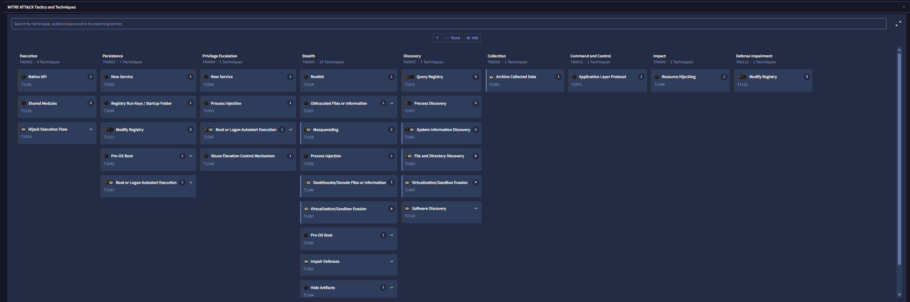

---

## Environment Setup

- **VM:** VirtualBox — Swordfish II (Windows 11, 64-bit, 8GB RAM)
- **Network:** NAT adapter disabled after sample download, before extraction
- **Defender:** Real-time Protection and Tamper Protection disabled before analysis
- **Snapshot:** clean-baseline taken before sample transfer
- **Sample source:** MalwareBazaar — tag:Jigsaw, downloaded with ZIP password `infected`

Windows Defender configuration before analysis:

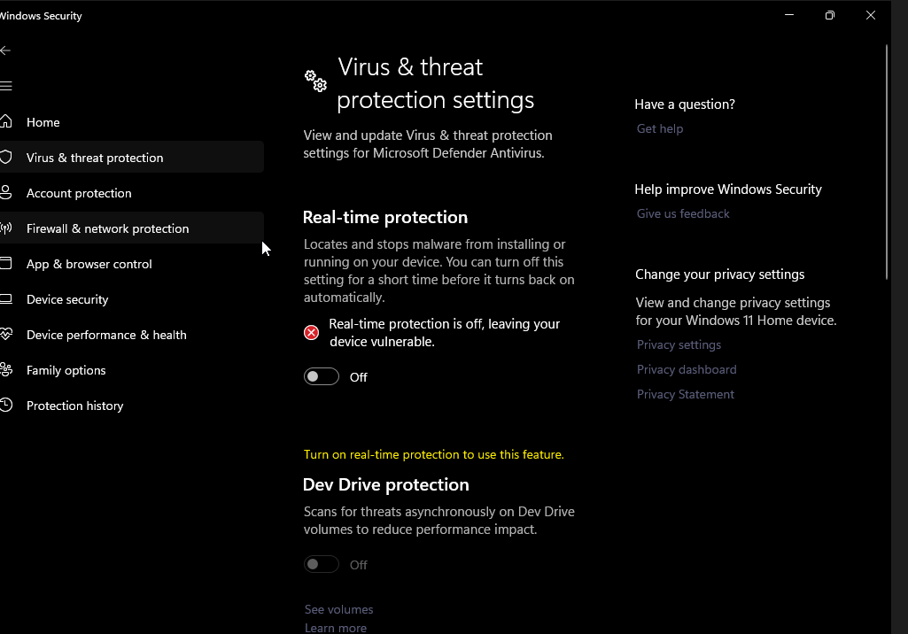

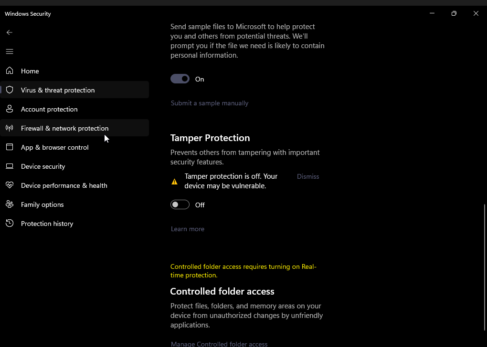

---

## Lab Series

This is part of the Cowboy Bebop Homelab series. All VMs are named after ships from the show.

- Bebop — Ubuntu/Splunk SIEM
- Swordfish II — Windows 11 analysis workstation
- Red Dragon — Kali Linux

Previous lab: [Cowboy Bebop Threat Hunting Lab](https://medium.com/@jwilliams.cyber)

Medium post: https://medium.com/p/43d2a0759624

---

## Dynamic Analysis

**Date:** June 15, 2026
**Environment:** Swordfish II — Windows 11 VM, VirtualBox, Host-Only network adapter
**Tools:** Process Monitor (Sysinternals), Wireshark 4.6.6

### Setup

ProcMon and Wireshark were running before detonation. Host-Only adapter, Defender off, clean snapshot in place.

First run threw a .NET path length exception. The filename was the full SHA256 hash — 64 characters — which pushed the full path past Windows’ 260-character limit. Renamed it to `jigsaw.exe` and it launched.

### Execution

First thing on screen was a .NET initialization error: "DeltaSEC Has Successfully hacked ur pc: NOW see the results." Confirmed execution.

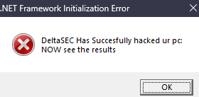

### Persistence

Jigsaw dropped copies of itself to two AppData locations:

- `C:\Users\46jay\AppData\Roaming\deltasec\deltasec.exe`
- `C:\Users\46jay\AppData\Local\deltasec\deltasec.exe`

Both folders showed up at 2:24 PM — the same minute as detonation. A third folder, `System32Work`, appeared in AppData\Roaming. The binary’s description field was `deltasechax`, which matched the DeltaSEC Corp alias from static analysis strings.

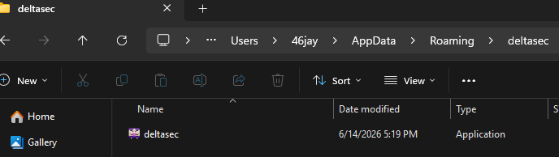

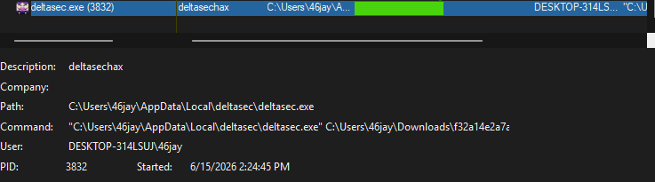

### Process Behavior

ProcMon logged 3.6 million events. Filtered to `deltasec.exe`: rapid registry queries against `HKLM\SOFTWARE\Microsoft\Windows`, thread creation across multiple PIDs, file reads against the .NET Framework and NativeImages assembly cache. A lot of scanning. No encryption.

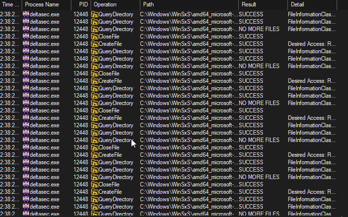

### File Encryption

Never triggered. This is a 2016 .NET sample on Windows 11 — the ransomware logic has compatibility issues that block detonation. No `.locked` extension, no ransom screen, no countdown timer. Persistence and process behavior came through clean.

### Network

Wireshark captured outbound TCP on port 443, but it overlapped with a .NET Framework download the sample needed to run. No way to isolate C2 traffic from framework traffic. Jigsaw’s C2 infrastructure has been offline since 2016 anyway.

### MITRE ATT&CK — Dynamic Findings

| Technique ID | Name | Evidence |
|---|---|---|
| T1486 | Data Encrypted for Impact | Attempted — blocked by Windows 11 compatibility |
| T1547.001 | Boot/Logon Autostart: Registry Run Keys | deltasec.exe dropped to AppData, persistence confirmed |
| T1036.005 | Masquerading | Binary renamed deltasechax, copied to mimic legitimate path |
| T1083 | File and Directory Discovery | ProcMon showed directory enumeration across WinSxS |
| T1012 | Query Registry | RegQueryKey and RegQueryValue hits on HKLM and HKCU |

Medium post: https://medium.com/@jwilliams.cyber/hunting-jigsaw-on-swordfish-ii-dynamic-analysis-with-process-monitor-bf9d59f871f9
